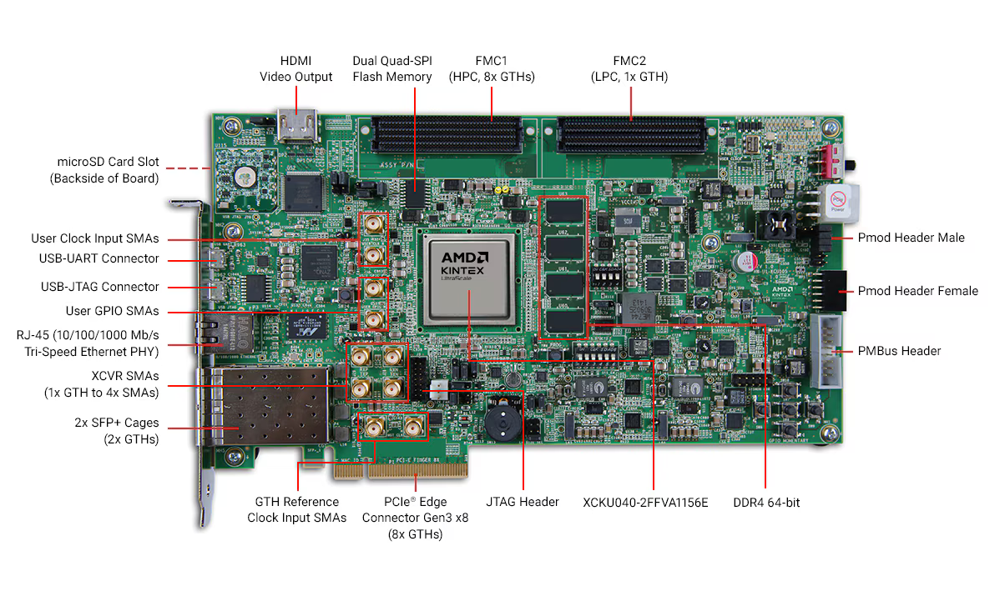

<h1 align="center">
     
    
     
    KCU105 Evaluation Kit Projects
     
</h1>

> [!WARNING]
> This repository is unfinished. Keep your expectations low.

## Getting Started

- [Product Page](https://www.amd.com/en/products/adaptive-socs-and-fpgas/evaluation-boards/kcu105.html)
- [Developer Resources](https://docs.amd.com/v/u/en-US/dh0034-ultrascale-hub)
