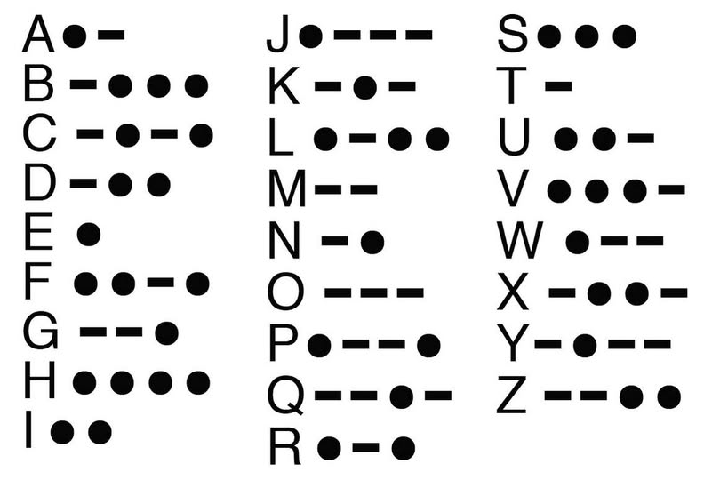

# Morse UART Decoder

This project uses SW7 (GPIO_SW_C) on the AMD KCU105 as a Morse key input.

The FPGA measures press and pause durations, decodes Morse symbols into plaintext letters, and streams the decoded text in real time at 115200 baud (8N1).

Note on KCU105 naming: the FPGA transmitter drives the board net `USB_UART_RX` (pin K26), which connects to the CP2105 `RXD` input.

Clock, switch, and UART pin assignments are provided in `constraints/morse_uart_decoder.xdc`.

Tool options for Verilator and Verible are read from the shared configuration directory at `../../config`.

## Morse Alphabet Table (A-Z)



## Usage

Run these commands from the project directory:

```bash
# Build the simulation
make

# Run simulation and generate dump.vcd
make run

# View waveform
surfer dump.vcd

# Format, syntax-check, and lint
make format

# Clean generated files
make clean
```

## Viewing UART Output

Linux example with `screen` (recommended stable path):

```bash
screen /dev/ttyUSB1 115200
```

or you can use [Tabby terminal](https://tabby.sh/).
